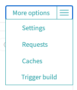
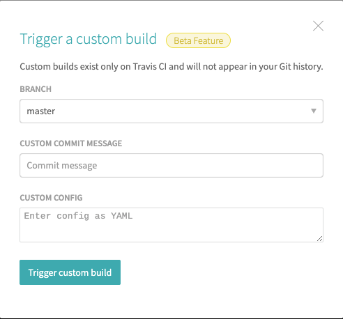

# BruinTutor

_"Walking among three people, I find my teacher among them. I choose that which is good in them and follow it, and that which is bad and change it.” \
-- Confucius_

## Docker configuration

All containers are accessible by their name:  
- `frontend` (ephemeral - exits after static file gen)
- `backend` (uwsgi instance)
- `redis`

**Exposed ports** are accessible from container to container. These are:
- `backend:5000` (uwsgi TCP port, used to forward nginx)
- `redis:6379` (redis DB port, used by backend to communicate with redis)

**Published ports** are accessible from host to container.  
`backend:80` is the only such port, which can be reached from `localhost:8080`

## Developing with Docker
*equivalents exist for Docker Desktop*

### Full Stack

After changes, rebuild the stack:  
`docker-compose build`

Start the full stack:  
`docker-compose up`

### Individual containers

Find a running container:  
`docker ps`

Kill a container:  
`docker kill <container_id>`

Get shell in running container:  
`docker exec -it <container ID> sh`

### Images

Find an image:  
`docker images`

Start shell in image, INSTEAD of regular entrypoint or CMD:  
`docker run -it <image ID> sh`

### Volumes

Find a data volume:  
`docker volume ls`

Drop shell in data volume (look at what's inside by creating a temporary busybox
container):  
`docker run -it --rm -v <vol_name>:/vol busybox sh`

### Flags

Bind LOCAL_PORT to CONTAINER_PORT (this can only be done when starting a
container):  
`-p LOCAL_PORT:CONTAINER_PORT`

Detach container and keep it running in background: `-d`

### Misc

Delete cached images:  
`docker system prune`

Create a local redis instance connectable from localhost:6379:
`docker run --rm -d -p 6379:6379 redis:alpine`

## CI Process
The CI process is triggered upon each change to a branch or to a Pull Request on Github
to trigger the process, you can upload contents from your local branch through `git push origin local-branch`. 
To manually trigger the build process, you can go to the [bruintutor Travis CI page](https://travis-ci.com/github/cs130-w21/bruintutor). 
Here there will be a dropdown menu beside more options that looks like:

When trigger build is pressed, this should lead you to a popup that looks like:

Press "Trigger Custom Build" to begin the manually created build process.

Also located at the [bruintutor Travis CI page](https://travis-ci.com/github/cs130-w21/bruintutor) is the history of builds
from all the PR requests created in this project. This will give an idea of how the CI process has developed.